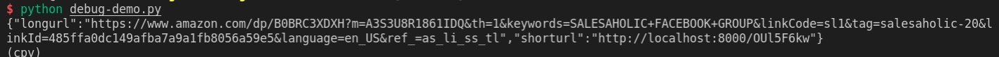

# 亚马逊长链接转换为短链接
长链接 => https://www.amazon.com/dp/B0BRC3XDXH?m=A3S3U8R1861IDQ&th=1&keywords=SALESAHOLIC+FACEBOOK+GROUP&linkCode=sl1&tag=salesaholic-20&linkId=485ffa0dc149afba7a9a1fb8056a59e5&language=en_US&ref_=as_li_ss_tl

转换后
短链接 => http://localhost/OUl5F6kw   (或者可以替换localhost为指定的域名)

# 使用:
Python3.10

```
pip install -r requirements.txt
```

```
python manage.py runserver 0.0.0.0:8000
```

### 使用示例代码 debug-demo.py 这个脚本去验证结果

### 示例结果:


公众号：
