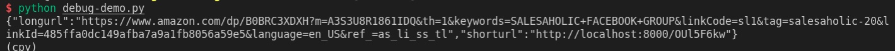

# Amazon Long url convert to short url
|[中文帮助](README-zh.MD)|

long url => https://www.amazon.com/dp/B0BRC3XDXH?m=A3S3U8R1861IDQ&th=1&keywords=SALESAHOLIC+FACEBOOK+GROUP&linkCode=sl1&tag=salesaholic-20&linkId=485ffa0dc149afba7a9a1fb8056a59e5&language=en_US&ref_=as_li_ss_tl

After convertion
short url => http://localhost/OUl5F6kw   (alternatively you can repalce localhost with specified domain as you need)

# Usage:
Python:3.10

```
pip install -r requirements.txt
```

```
python manage.py runserver 0.0.0.0:8000
```

### Example code： debug-demo.py 

### Example Reuslt:


### Wechat


